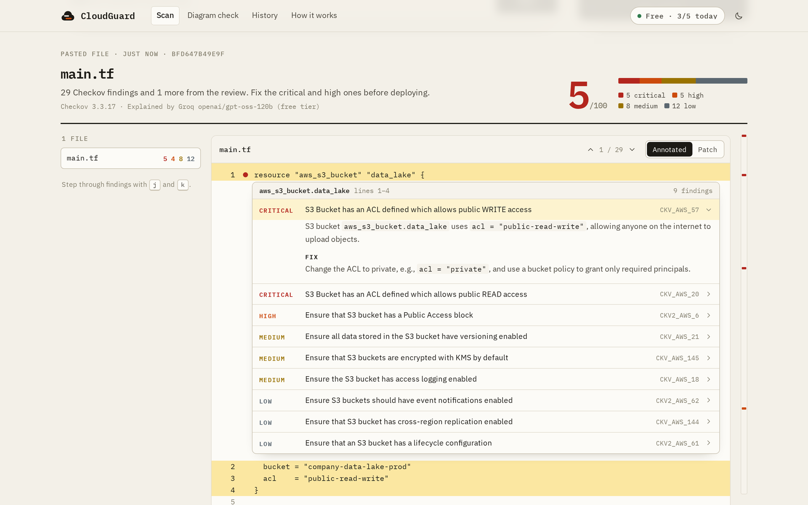

# CloudGuard

CloudGuard reviews infrastructure code for security problems before it's deployed. It reads Terraform, CloudFormation, Kubernetes, Helm, Docker Compose and Dockerfiles, runs them through [Checkov](https://www.checkov.io/)'s policy set, and shows every finding on the line it comes from. An explained scan adds what each finding puts at risk in that specific code, flags problems no policy covers, and writes a patched file to compare against the original.

It runs as a web app, a command-line tool and a GitHub Action.

**Live instance:** [cloud-guard-ai.duckdns.org](https://cloud-guard-ai.duckdns.org)



## What it does

- **Scans a file, a zip or a public GitHub repository.** Configuration files are picked out of the upload and everything else is ignored.
- **Scores deterministically.** The score comes only from Checkov findings, rated by severity per policy, so the same code always gets the same score.
- **Explains findings in context.** A language model describes what each finding means for the resource in question and how to fix it, and lists issues that no policy covers (such as credentials in a Compose file) separately from the scored results.
- **Writes patches.** Files with the most serious findings are rewritten with the fixes applied and shown as a diff.
- **Learns from earlier fixes.** Findings are embedded with a local model and stored in PostgreSQL with pgvector; similar past fixes from the same user are passed to the model as examples.
- **Checks architecture drift.** An uploaded diagram is compared with the Terraform that should implement it.
- **Works with any major model provider.** A free tier runs on the server's Groq key with daily and per-minute limits; users can bring their own OpenAI, Anthropic, Google, xAI, Groq or Mistral key, which stays in their browser.
- **Fits into pull requests.** The GitHub Action comments on each pull request with findings in the changed files and can fail the check at a chosen severity.

## Quick start

With Docker or Podman:

```bash
git clone https://github.com/rajashekharsunkara/cloud-guard-ai.git
cd cloud-guard-ai
cp .env.example .env        # optionally set GROQ_API_KEY for free explained scans
docker compose up --build
```

Open `http://localhost:8000`. The interactive API reference is at `http://localhost:8000/docs`. PostgreSQL and LocalStack (for S3) start alongside the app, so nothing outside your machine is contacted except the model provider during explained scans.

Without a Groq key, scans still run and show every Checkov finding; explanations and patches are available by adding a provider key in **Model settings**.

To scan from a terminal instead:

```bash
pip install -r requirements-cli.txt
python -m venv .checkov && .checkov/bin/pip install -r requirements-checkov.txt
CHECKOV_BIN=.checkov/bin/checkov python -m backend.cli scan path/to/infra --fail-on high
```

## GitHub Action

```yaml
# .github/workflows/cloudguard.yml
on: pull_request
permissions:
  contents: read
  pull-requests: write
jobs:
  scan:
    runs-on: ubuntu-latest
    steps:
      - uses: actions/checkout@v4
        with:
          fetch-depth: 0
      - uses: rajashekharsunkara/cloud-guard-ai@main
        with:
          path: infra
          fail-on: high
          # Optional explanations with your own key:
          # provider: anthropic
          # api-key: ${{ secrets.ANTHROPIC_API_KEY }}
```

Each pull request gets one comment, updated on every push, listing findings in the files it changes. The check fails only on Checkov findings at or above `fail-on`, so the result doesn't depend on a model. Inputs, outputs and CI examples for other systems are in [GitHub Action and CLI](docs/github-action-and-cli.md).

## How it's built

- **Static analysis decides, the model explains.** Scores and pass/fail come only from Checkov, rated by a fixed severity table. Model output is shown separately, never scored, and every model failure falls back to the complete Checkov report with a specific reason and next step.
- **One provider interface over six APIs.** The official OpenAI, Anthropic and Google SDKs cover all six providers, with structured JSON output, image input, live model lists and a shared classification of auth, rate-limit, daily-limit and size errors.
- **A shared free tier that stays usable.** Per-IP rate limits, a daily quota enforced atomically in PostgreSQL, a cap on concurrent scans, token budgets sized to the provider's per-minute allowance, and shared back-off when the provider reports a limit.
- **Untrusted input handled as untrusted.** Archives are read in memory with size, count and path checks; repository downloads can only reach GitHub; Checkov runs in a subprocess with an empty environment and a timeout; visitors' API keys are used per request and never stored or logged.
- **Private without accounts.** Each browser gets an anonymous workspace, and history, search and the earlier fixes given to the model are all scoped to it.
- **Cheap to run.** One 2 GB ARM instance with Docker Compose and Caddy, local embeddings instead of a paid API, and daily database backups to S3.

The reasoning behind each of these is in [Architecture](docs/architecture.md) and [Security](docs/security.md).

## Documentation

| Guide | Covers |
|-------|--------|
| [Architecture](docs/architecture.md) | Components, the scan pipeline, data model, and the reasoning behind the main design choices |
| [API reference](docs/api.md) | Endpoints, request and response formats, the streaming event format, limits and errors |
| [GitHub Action and CLI](docs/github-action-and-cli.md) | Pull request scanning, command-line options, output formats and exit codes |
| [Configuration](docs/configuration.md) | Every environment variable and the model budget settings |
| [Deployment](docs/deployment.md) | Running on AWS (EC2 with Docker Compose, RDS, ECS), TLS, IAM, backups, upgrades and operations |
| [Security](docs/security.md) | Threat model and the controls around uploads, keys, the scanner and user data |
| [Development](docs/development.md) | Project layout, local setup, tests, CI, and extending severities or providers |

## Stack

| Layer | Technology |
|-------|------------|
| API | Python 3.12, FastAPI, Uvicorn, Pydantic |
| Static analysis | Checkov 3.3, run as an isolated subprocess |
| Language models | OpenAI, Anthropic and Google GenAI SDKs (the OpenAI SDK also serves xAI, Groq and Mistral) |
| Embeddings | BAAI bge-small-en-v1.5 via fastembed and ONNX Runtime, on the server |
| Storage | PostgreSQL 16 with pgvector, S3 |
| Frontend | HTML, CSS and ES modules with no build step |
| Delivery | Docker, Docker Compose, GitHub Actions, AWS EC2 behind Caddy |

## Project layout

```
backend/
  app/
    core/        configuration, database, rate limiting, per-browser workspaces
    routers/     HTTP API
    services/    scan pipeline, Checkov runner, model providers, sources, storage
    prompts/     review, patch and diagram prompts
  cli.py         command-line scanner
  tests/         unit and integration tests
frontend/        web interface
deploy/backup/   database backup container
docs/            guides
action.yml       GitHub Action
```

## Tests

```bash
pip install -r requirements.txt -r requirements-dev.txt
python -m venv .checkov && .checkov/bin/pip install -r requirements-checkov.txt
docker compose up -d postgres localstack
CHECKOV_BIN=.checkov/bin/checkov pytest backend/tests
```

CI runs flake8, black and the full test suite against PostgreSQL and LocalStack service containers, then builds the image. See [Development](docs/development.md) for what the suite covers.

## License

[MIT](LICENSE)
