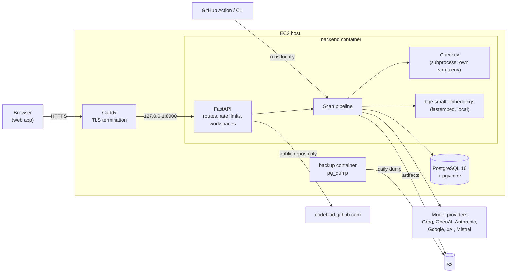
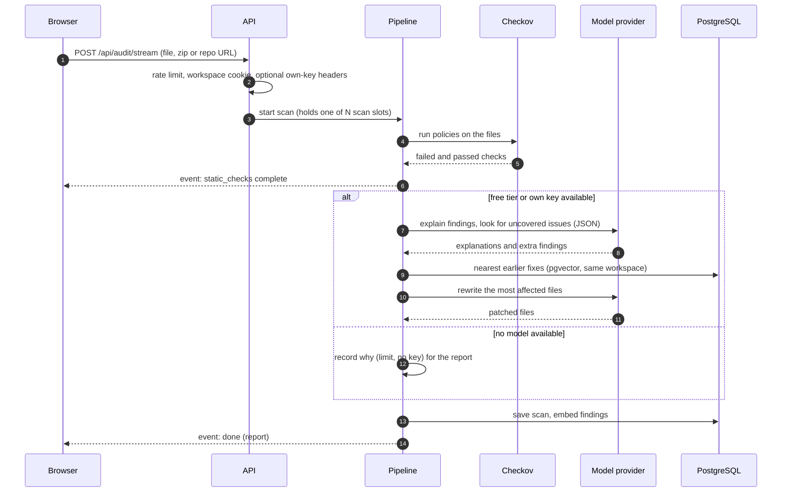

# Architecture

This guide describes how CloudGuard is put together and why it's built the way it is. For endpoint details see the [API reference](api.md); for running it see [Deployment](deployment.md).

## Components

| Component | Responsibility |
|-----------|----------------|
| `backend/app/routers/auditor.py` | HTTP API: validation, rate limits, streaming responses |
| `backend/app/core/workspace.py` | Assigns each browser an anonymous workspace through an HttpOnly cookie |
| `backend/app/core/ratelimit.py` | Per-IP sliding-window limits and a cap on concurrent scans |
| `backend/app/services/sources.py` | Turns pasted text, zip uploads and GitHub repositories into a set of files, with size and safety limits |
| `backend/app/services/checkov.py` | Runs Checkov in an isolated subprocess and parses its output |
| `backend/app/services/severity.py` | Severity ratings per Checkov policy and the score formula |
| `backend/app/services/pipeline.py` | Orchestrates a scan and emits progress events |
| `backend/app/services/llm.py` | One interface over six model providers: JSON output, image input, model listing, error classification |
| `backend/app/services/agents.py` | Review, patch and diagram prompts built on the provider interface |
| `backend/app/services/embeddings.py` | Local embedding model for search and earlier-fix lookup |
| `backend/app/services/usage.py`, `free_tier.py` | Daily free-scan quota per client, and the shared free tier's rate-limit state |
| `backend/cli.py`, `action.yml` | The same pipeline without the database or S3, for terminals and CI |
| `frontend/` | The web app: scan intake, annotated report, history, model settings |
| `deploy/backup/` | Container that dumps PostgreSQL to S3 on a schedule |

## A scan, step by step

1. **Collect files.** Pasted text becomes a single file. Zips and repository tarballs are read in memory with limits on size, file count and archive entries; only configuration file types are kept. See [Security](security.md#uploads-and-repositories).
2. **Run Checkov.** Files are written to a temporary directory and Checkov runs as a subprocess with a clean environment and a timeout. Passed checks tell the pipeline which files Checkov actually understood; generic secret scanning doesn't count as coverage.
3. **Rate and score.** Each finding gets a severity from `severity.py`. The score uses only Checkov findings in covered files.
4. **Decide whether a model is available.** In order: the user's own key, otherwise the server's free tier if it isn't rate limited and the user has free scans left. If none apply, the scan continues with Checkov results and records a `limit` explaining why.
5. **Review.** The files with the most serious findings, up to a size budget, and a numbered list of findings go to the model, which returns explanations by reference number plus additional findings. Anthropic models get a JSON schema; other providers get JSON mode.
6. **Earlier fixes.** The combined findings are embedded and compared with the user's own earlier findings; the closest matches and their patches are included as examples.
7. **Patch.** Files are ranked by their worst finding and rewritten one at a time (or a few in parallel with an own key), each with only its own findings.
8. **Save.** The scan, findings, patches and the source of files with findings are stored; findings are embedded for search; originals and patches are copied to S3.

Every step emits a server-sent event, so the web app shows progress as it happens. The non-streaming endpoint runs the same generator and returns the final result.

## Data model

| Table | Holds |
|-------|-------|
| `audits` | One row per scan: workspace, label, score, findings (JSONB), sources and patches (JSONB), analysis metadata, diagram report |
| `vulnerabilities` | One row per finding with a 384-dimension embedding, for search and earlier-fix lookup |
| `llm_usage` | Free explained scans per client per UTC day, keyed by a salted hash of the client IP |

Tables are created on startup. Later schema changes are idempotent statements in `backend/app/core/database.py` that run on every start, so upgrading is a matter of deploying the new image.

## Design decisions

### A static analyzer decides; the model explains

Models are good at explaining a problem in context and poor at producing the same answer twice. Checkov is the opposite. CloudGuard lets Checkov determine what's wrong and what the score is, and uses the model for the parts that benefit from language: explanations, fixes and issues outside any policy. Model output is never counted in the score and is labelled as coming from the review.

Checkov's open-source release has no severities, so `severity.py` rates each policy: explicit ratings for well-known checks, then keyword rules on the check name. The score is `100 × e^(−points/80)` with 30, 12, 4 and 1 points for critical, high, medium and low. The curve makes the first serious issues count most while a long tail of minor warnings can't push an otherwise sound file to zero.

### Degrade instead of failing

A scan only fails if Checkov itself can't run. Everything that depends on a model can fall back:

| Situation | Result |
|-----------|--------|
| Review response isn't valid JSON | Checkov results with a notice; the free scan is refunded |
| Provider per-minute limit | Checkov results, a countdown to retry, and a prompt to use an own key; other scans skip the model until it resets |
| Provider daily limit | Checkov results with the reset time; the free tier is paused for everyone until then |
| Request too large for the free model | Checkov results with a suggestion to scan less code or use an own key |
| Own key rejected, model missing, quota exhausted | Checkov results with a specific message about the key |
| Patch fails after a successful review | Explanations kept; the patch notice says why |

Each case produces a structured `limit` object (see the [API reference](api.md#the-limit-object)) so the interface can offer the right next step rather than a generic error.

### Protecting a shared free tier

The free tier runs on one Groq key with a small per-minute token allowance, shared by every visitor. Several layers keep it usable:

- **Per-IP rate limits** on scans and search, and a cap on concurrent scans so bursts queue briefly instead of exhausting memory.
- **A daily quota per client** in PostgreSQL. Claims use a single `INSERT ... ON CONFLICT ... WHERE count < limit RETURNING` statement, so concurrent requests can't exceed it; failures refund the claim.
- **Shared limit state.** When the provider reports a per-minute or per-day limit, the pipeline records when it resets and later scans skip the model until then, instead of each sending a request that will fail.
- **Budgets sized to the allowance.** Review and patch requests are capped by characters of source (Terraform averages about 2.5 characters per token) so a single request never exceeds the per-minute limit. Own-key scans use much larger budgets.

### Bring your own key without storing it

Keys stay in the user's browser and are sent per request in `X-LLM-*` headers. The server validates the format, uses the key for that request only, and never writes it to the database or logs; provider errors are logged by classification rather than message, since some providers echo part of the key. Provider base URLs are fixed in code, so a request can't redirect the server to an internal address. The model list comes from the provider's own models endpoint using the user's key, which keeps it current without a hard-coded catalogue.

### Anonymous workspaces

There are no accounts. Each browser gets a random workspace ID in an HttpOnly, SameSite=Lax cookie, and every read and write is filtered by it: history, search and the earlier fixes used as patch examples. That last point matters beyond privacy; without it, one visitor's stored patches could be fed into another visitor's prompts.

### Local embeddings

Findings are embedded with bge-small-en-v1.5 running in the app through ONNX Runtime. It needs no key, has no per-minute quota, embeds a hundred findings in under a second on ordinary hardware, and keeps findings off third-party services for this step. The model is baked into the image so containers start without network access to model hubs.

### Checkov in its own virtualenv

Checkov has a large dependency tree that would otherwise have to agree with the app's pins. The image installs it into `/opt/checkov` from a fully pinned requirements file and calls the binary, which also isolates it from the app's environment variables.

## Performance notes

- A Checkov run takes one to five seconds and peaks around 200 MB of memory.
- An explained scan of a single file takes roughly 15 to 60 seconds, mostly model time. Large repositories on the free tier can take several minutes because patch requests wait for the per-minute allowance.
- The app idles around 170 MB; the embedding model loads on first use. On a 2 GB instance, keep `MAX_CONCURRENT_SCANS` at 2 and add swap.
