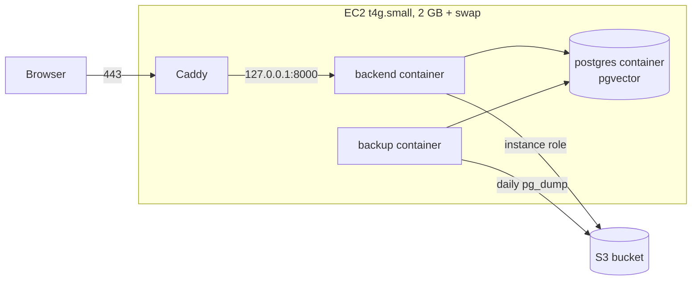

# Deployment

CloudGuard is a single container plus PostgreSQL and an S3 bucket. The public instance runs on one small ARM EC2 instance with Docker Compose and Caddy, which is the setup this guide walks through first. Managed alternatives (RDS, ECS) follow.



## Requirements

| Resource | Minimum | Notes |
|----------|---------|-------|
| Instance | 2 vCPU, 2 GB memory, 20 GB disk | `t4g.small` (ARM) or `t3.small`. Add 2 GB of swap on 2 GB instances |
| Software | Docker Engine with the Compose plugin, or Podman with `podman compose` | The image builds on both `amd64` and `arm64` |
| AWS | One S3 bucket, an IAM role for the instance | No other AWS services are required |
| DNS | A domain or subdomain pointing at the instance | Needed for TLS. A free dynamic DNS name works |
| Model provider | A Groq API key (optional) | Without it, scans are Checkov only unless visitors add their own key |

## Single EC2 host

### 1. Create the bucket

With the AWS CLI:

```bash
export BUCKET=cloudguard-artifacts-yourname REGION=eu-north-1
aws s3api create-bucket --bucket "$BUCKET" --region "$REGION" \
  --create-bucket-configuration LocationConstraint="$REGION"
aws s3api put-public-access-block --bucket "$BUCKET" \
  --public-access-block-configuration BlockPublicAcls=true,IgnorePublicAcls=true,BlockPublicPolicy=true,RestrictPublicBuckets=true
aws s3api put-bucket-versioning --bucket "$BUCKET" --versioning-configuration Status=Enabled
```

Or with the Terraform in `terraform/`, which creates the bucket with versioning, AES-256 encryption and a public access block. `terraform/localstack.tf` points the provider at LocalStack for local work; for AWS, replace its `provider "aws"` block with one that only sets `region`, then:

```bash
cd terraform
terraform init
terraform apply -var s3_bucket_name="$BUCKET" -var aws_region="$REGION" -var environment=production
```

The app also creates the bucket on startup if it's missing and the role allows it.

Add a lifecycle rule so old backups expire:

```bash
aws s3api put-bucket-lifecycle-configuration --bucket "$BUCKET" --lifecycle-configuration '{
  "Rules": [{
    "ID": "expire-old-backups",
    "Filter": {"Prefix": "backups/"},
    "Status": "Enabled",
    "Expiration": {"Days": 30},
    "NoncurrentVersionExpiration": {"NoncurrentDays": 7}
  }]
}'
```

### IAM

Create a role for EC2 with this policy and attach it to the instance as an instance profile. The app and the backup container both use it, so no access keys are stored on the host.

```json
{
  "Version": "2012-10-17",
  "Statement": [
    {
      "Effect": "Allow",
      "Action": ["s3:ListBucket", "s3:CreateBucket"],
      "Resource": "arn:aws:s3:::cloudguard-artifacts-yourname"
    },
    {
      "Effect": "Allow",
      "Action": ["s3:GetObject", "s3:PutObject"],
      "Resource": "arn:aws:s3:::cloudguard-artifacts-yourname/*"
    }
  ]
}
```

`s3:CreateBucket` is only needed if you want the app to create the bucket itself. Restores are done by an operator, so the role doesn't need delete permissions.

### 2. Launch the instance

- **AMI:** Ubuntu 24.04 LTS or Amazon Linux 2023, ARM64 for `t4g`.
- **Security group:** 80 and 443 from anywhere (80 is used for certificate issuance and redirects), 22 from your address only, or no SSH at all and Session Manager instead.
- **Instance metadata:** IMDSv2 required, with a **hop limit of 2**. Containers are one network hop further from the metadata service than the host, and with the default hop limit of 1 they can't get role credentials.

```bash
aws ec2 modify-instance-metadata-options --instance-id i-0123456789abcdef0 \
  --http-tokens required --http-put-response-hop-limit 2
```

- **Elastic IP:** allocate one so the address survives stop and start.

### 3. Prepare the host

Install Docker (Ubuntu shown):

```bash
sudo apt-get update && sudo apt-get install -y ca-certificates curl git
curl -fsSL https://get.docker.com | sudo sh
sudo usermod -aG docker "$USER"   # log out and back in
```

Add swap on 2 GB instances. The image build and an occasional large scan can briefly exceed physical memory:

```bash
sudo fallocate -l 2G /swapfile && sudo chmod 600 /swapfile
sudo mkswap /swapfile && sudo swapon /swapfile
echo '/swapfile none swap sw 0 0' | sudo tee -a /etc/fstab
```

### 4. Configure

```bash
git clone https://github.com/rajashekharsunkara/cloud-guard-ai.git
cd cloud-guard-ai
cp .env.example .env
chmod 600 .env
```

Edit `.env`:

```bash
GROQ_API_KEY=gsk_...                       # optional
POSTGRES_USER=cloudguard
POSTGRES_PASSWORD=<long random value>      # openssl rand -hex 24
POSTGRES_DB=cloudguard_db

# Delete AWS_ENDPOINT_URL, AWS_ACCESS_KEY_ID and AWS_SECRET_ACCESS_KEY,
# or leave them empty, so the instance role is used.
AWS_DEFAULT_REGION=eu-north-1
S3_BUCKET_NAME=cloudguard-artifacts-yourname

CORS_ORIGINS=https://cloudguard.example.com
```

`DATABASE_URL` and `APP_ENV` are set by `docker-compose.prod.yml`. Every other setting is described in [Configuration](configuration.md).

### 5. Start

```bash
docker compose -f docker-compose.prod.yml up --build -d
docker compose -f docker-compose.prod.yml ps
curl -s http://127.0.0.1:8000/api/health
```

The first build takes a few minutes on `amd64` and around ten on a small ARM instance, mostly installing Checkov and downloading the embedding model into the image. The app creates its tables and the `vector` extension on first start.

The stack has three services, all with `restart: always`:

| Service | Purpose |
|---------|---------|
| `postgres` | PostgreSQL 16 with pgvector, data in the `pgdata` volume, not published to the host |
| `backend` | The app, published on `127.0.0.1:8000` only, with a health check |
| `backup` | Dumps the database to S3 at startup and then daily |

### 6. TLS with Caddy

Point your DNS record at the Elastic IP, then install Caddy ([instructions](https://caddyserver.com/docs/install)) and set `/etc/caddy/Caddyfile`:

```
cloudguard.example.com {
    reverse_proxy localhost:8000 {
        flush_interval -1
    }
}
```

```bash
sudo systemctl reload caddy
```

Caddy obtains and renews the certificate. `flush_interval -1` sends scan progress events to the browser as they happen; Caddy usually detects event streams on its own, but setting it avoids buffering surprises. Caddy passes `X-Forwarded-For` and `X-Forwarded-Proto`, and the Compose file trusts those headers from the Docker bridge, so rate limits see real client addresses and cookies are marked `Secure`.

With nginx instead, disable buffering for the API:

```nginx
location / {
    proxy_pass http://127.0.0.1:8000;
    proxy_set_header Host $host;
    proxy_set_header X-Forwarded-For $proxy_add_x_forwarded_for;
    proxy_set_header X-Forwarded-Proto $scheme;
    proxy_buffering off;
    proxy_read_timeout 600s;
    client_max_body_size 12m;
}
```

### 7. Verify

```bash
curl -s https://cloudguard.example.com/api/health
# {"status":"healthy","database":"connected","s3":"connected","environment":"production"}

docker compose -f docker-compose.prod.yml logs backup | tail -n 3
# ... backup ok: s3://cloudguard-artifacts-yourname/backups/cloudguard-20260917T000000Z.dump (48213 bytes)
```

Then run a scan in the browser and check that it appears under History, and that a different browser doesn't see it.

## Operations

### Upgrades

```bash
cd ~/cloud-guard-ai
docker compose -f docker-compose.prod.yml exec backup cloudguard-backup --once
git pull
docker compose -f docker-compose.prod.yml up --build -d
```

Schema changes are applied automatically when the new container starts; each one is idempotent, so restarting is always safe. The site is unavailable for the few seconds the backend takes to restart; scans in progress at that moment fail and can be re-run.

To roll back, restore the backup taken before the upgrade, check out the previous commit and run the same `up --build -d`.

### Changing settings

Edit `.env`, then recreate the containers that read it. A plain restart keeps the old values.

```bash
docker compose -f docker-compose.prod.yml up -d --force-recreate backend backup
```

### Logs

```bash
docker compose -f docker-compose.prod.yml logs -f backend
```

The app logs startup checks, scan failures with a classification (`review failed for audit 3e62c9e3864a: rate_limit (429)`), Checkov errors and unhandled exceptions. It doesn't log request bodies, source code or API keys. Docker's default JSON log driver has no size limit; on a long-running host set one in `/etc/docker/daemon.json`:

```json
{ "log-driver": "json-file", "log-opts": { "max-size": "20m", "max-file": "3" } }
```

### Backups and restore

Backups are custom-format dumps at `s3://<bucket>/backups/cloudguard-<UTC timestamp>.dump`. To take one now:

```bash
docker compose -f docker-compose.prod.yml exec backup cloudguard-backup --once
```

To restore:

```bash
aws s3 ls s3://cloudguard-artifacts-yourname/backups/
aws s3 cp s3://cloudguard-artifacts-yourname/backups/cloudguard-20260917T000000Z.dump restore.dump

docker compose -f docker-compose.prod.yml stop backend
docker compose -f docker-compose.prod.yml exec -T postgres \
  pg_restore --clean --if-exists --no-owner -U cloudguard -d cloudguard_db < restore.dump
docker compose -f docker-compose.prod.yml start backend
```

Test a restore into a scratch database occasionally; a backup that has never been restored isn't a backup yet.

### Monitoring

- **Health:** `GET /api/health` reports database and S3 connectivity and is cheap enough for a one-minute external uptime check. Alert when `status` isn't `healthy`.
- **Container health:** the backend has a Docker health check, visible in `docker compose ps`.
- **Host:** a CloudWatch alarm on `StatusCheckFailed` with an EC2 recover action handles hardware failures. Memory and disk need the CloudWatch agent.
- **Free tier:** `GET /api/usage` shows whether the shared Groq key is `busy` or `exhausted`. Frequent `exhausted` states mean it's time for a paid tier or a lower `FREE_LLM_SCANS_PER_DAY`.

### Sizing

On a `t4g.small` the app idles at about 170 MB, a Checkov run peaks around 200 MB, and PostgreSQL stays small. Two concurrent scans plus the embedding model fit in 2 GB with swap as a safety margin. Scale up the instance rather than raising `MAX_CONCURRENT_SCANS` without more memory.

## Managed alternatives

### Amazon RDS for PostgreSQL

pgvector is available on RDS for PostgreSQL 15.2 and later. Create the database, make sure the app's security group can reach it, remove the `postgres` service from the Compose file (or use your own) and set:

```bash
DATABASE_URL=postgresql+asyncpg://cloudguard:<password>@<endpoint>:5432/cloudguard_db
```

The app runs `CREATE EXTENSION IF NOT EXISTS vector` on startup, which needs a user allowed to create extensions (the RDS master user is). With RDS, use its automated backups and snapshots in place of the `backup` service.

### ECS on Fargate

The image runs unchanged as a Fargate task:

- **Task role** with the S3 policy above; no access keys in the task definition.
- **Secrets** (`GROQ_API_KEY`, `DATABASE_URL`) from Secrets Manager or SSM Parameter Store.
- **Size:** 1 vCPU and 2 GB per task.
- **Load balancer:** an ALB with an idle timeout of at least 300 seconds so long scan streams aren't cut off, health check path `/api/health`.
- **Client addresses:** set `FORWARDED_ALLOW_IPS` to the VPC CIDR so the ALB's `X-Forwarded-For` is trusted.

### Running more than one instance

Most state is in PostgreSQL and works across instances as it is: history, search, workspaces and the daily free-scan quota. Three things are per process and need attention before scaling out:

| Per-process state | Effect with N instances | Fix |
|-------------------|-------------------------|-----|
| IP rate limits | Each client gets N times the limit | Divide `SCAN_RATE_LIMIT` and `SEARCH_RATE_LIMIT` by N, or rate limit at the load balancer (AWS WAF rate-based rules) |
| Concurrent scan slots | Up to N × `MAX_CONCURRENT_SCANS` scans in total | Size each task for its own slots |
| Free tier busy/exhausted state | Other instances learn about a provider limit on their next failed request | Acceptable in practice; one extra failed request per instance |

Keep Uvicorn at a single worker per container and scale with containers instead, so each process's limits are predictable.

## Local development stack

`docker-compose.yml` runs the app with live reload, PostgreSQL and LocalStack for S3:

```bash
cp .env.example .env
docker compose up --build
```

See [Development](development.md) for running outside containers and for tests.

## Troubleshooting

| Symptom | Likely cause |
|---------|--------------|
| Health shows `"s3": "disconnected"` on EC2 | Instance profile missing, metadata hop limit still 1, or `AWS_ENDPOINT_URL` / access keys left in `.env` |
| Every visitor shares one rate limit | The proxy's address isn't in `FORWARDED_ALLOW_IPS`, so all requests appear to come from it |
| Scan progress appears all at once at the end | The proxy is buffering responses; see the Caddy and nginx settings above |
| `.env` change has no effect | The container was restarted, not recreated |
| Build killed on a small instance | Out of memory; add swap |
| Scans fail with "Checkov is not installed on the server" | `CHECKOV_BIN` overridden to a path that doesn't exist in the image |
| Explanations always say the free model is busy | The Groq key's per-minute allowance is too small for the budgets; lower the `LLM_*` budgets or use a paid tier |
